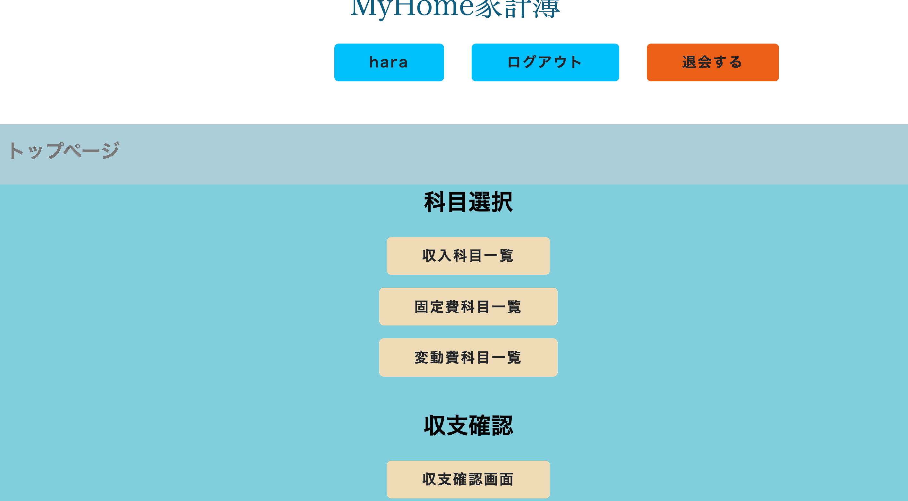
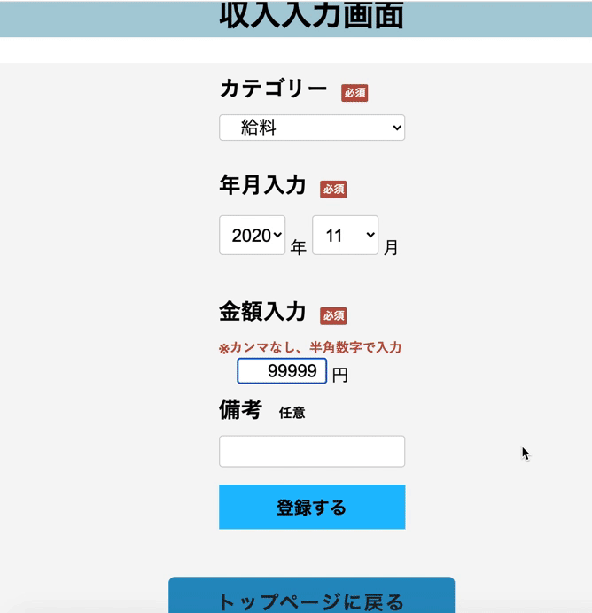
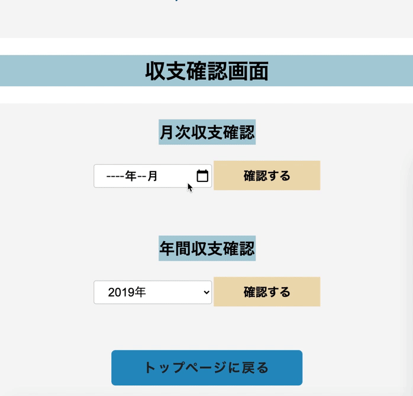
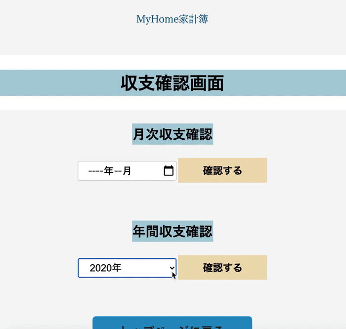

# アプリ名

### MyHome家計簿

# 概要

ユーザー登録すると収入と固定費・変動費が登録できます。 登録した収支の情報で月間の収支差と年間の収支差を確認できます。

# 本番環境

https://my-home-kakeibo.herokuapp.com/

ログイン情報（テスト用）

- Eメール : sample@sample.com
- パスワード : hitomi0722

# 制作背景

現在同棲をしていて将来マンションに住みたいという話になりましたが、お互いにお金の管理が上手くできていなかったので、相方にお金の管理を頼みたいと言われたのがキッカケで、家計簿アプリを作ってみようと思い制作しました。

# DEMO

### トップページ

### 科目情報入力登録画面

### 月次収支確認画面

### 年間収支確認画面

# 工夫したポイント

- 年間収支確認画面に月毎の収入・固定費・変動費のグラフを表示させたこと

# 使用技術（開発環境）

## バックエンド

Ruby,Ruby on Rails

## フロントエンド

HTML,CSS,JavaScript

## データベース

MySQL,SequelPro

## ソース管理

GitHub,GitHubDesktop

## テスト

RSpec

## エディタ

VSCode

# 課題や今後実装したい機能

- レスポンシブデザインの実装
- 貯金額の推移を表したグラフ表示の機能
- フロントの改良
- 固定費や変動費の情報をまとめて登録できる機能
- ユーザーの詳細画面やユーザー情報の編集画面

# テーブル設計

## users テーブル

| Column       | Type   | Options     |
| ------------ | ------ | ----------- |
| nickname     | string | null: false |
| email        | string | null: false |
| password     | string | null: false |

### Association

- has_many :incomes
- has_many :fixedcosts
- has_many :variablecosts

## incomes テーブル

| Column                 | Type       | Options                        |
| ---------------------- | ---------- | ------------------------------ |
| income_category_id     | integer    | null: false                    |
| value                  | integer    | null: false                    |
| description            | string     |                                |
| year_month             | date       | null: false                    |
| user                   | references | null: false, foreign_key: true |

### Association

- belongs_to :user

## fixedcosts テーブル

| Column                 | Type       | Options                        |
| ---------------------- | ---------- | ------------------------------ |
| fixedcost_category_id  | integer    | null: false                    |
| value                  | integer    | null: false                    |
| description            | string     |                                |
| year_month             | date       | null: false                    |
| user                   | references | null: false, foreign_key: true |

### Association

- belongs_to :user

## variablecosts テーブル

| Column                    | Type       | Options                        |
| ------------------------- | ---------- | ------------------------------ |
| variablecost_category_id  | integer    | null: false                    |
| value                     | integer    | null: false                    |
| description               | string     |                                |
| year_month                | date       | null: false                    |
| user                      | references | null: false, foreign_key: true |

### Association

- belongs_to :user

## savings テーブル

| Column        | Type       | Options                        |
| --------------| ---------- | ------------------------------ |
| saving        | integer    | null: false                    |
| day           | date       | null: false                    |
| user          | references | null: false, foreign_key: true |

### Association

- belongs_to :user